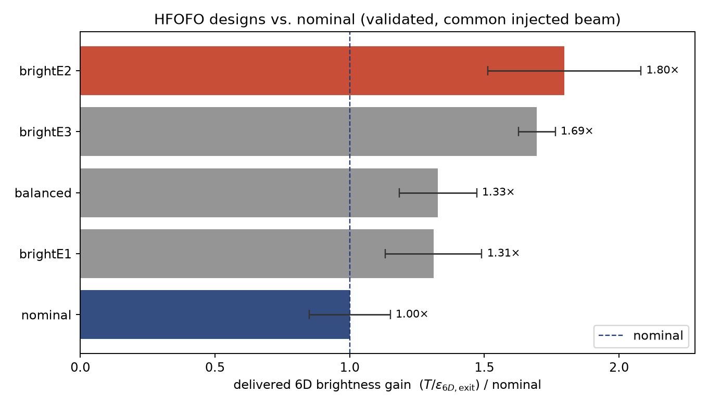
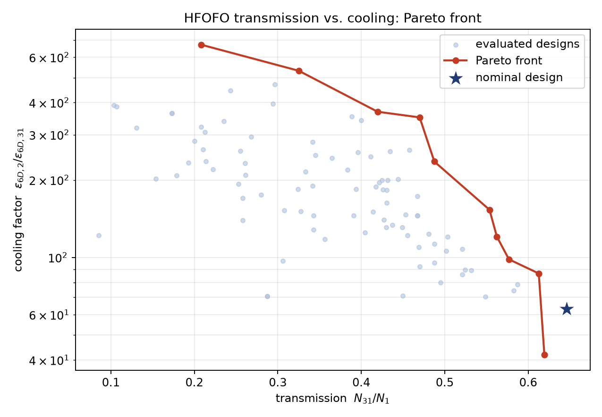
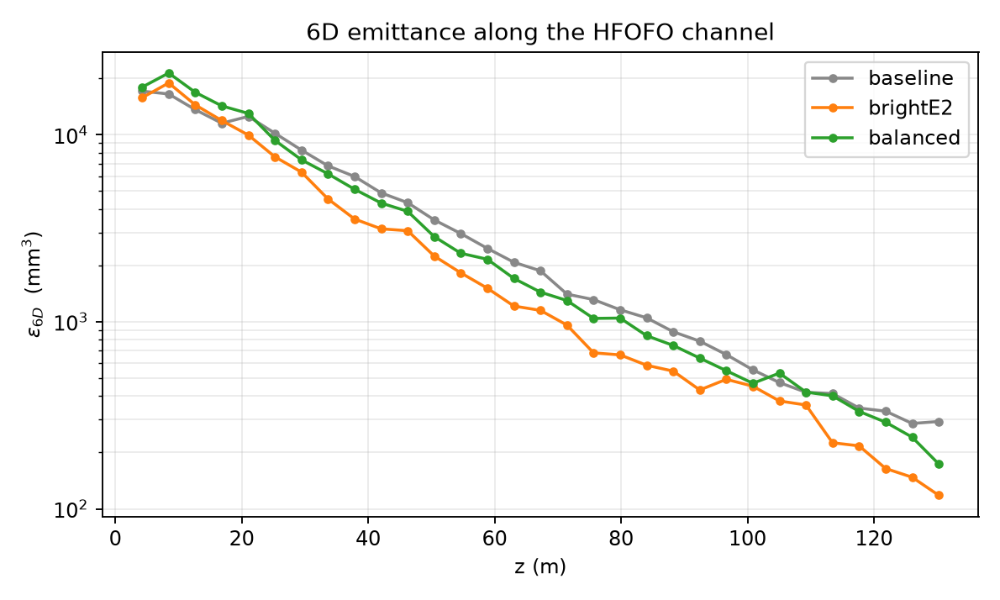
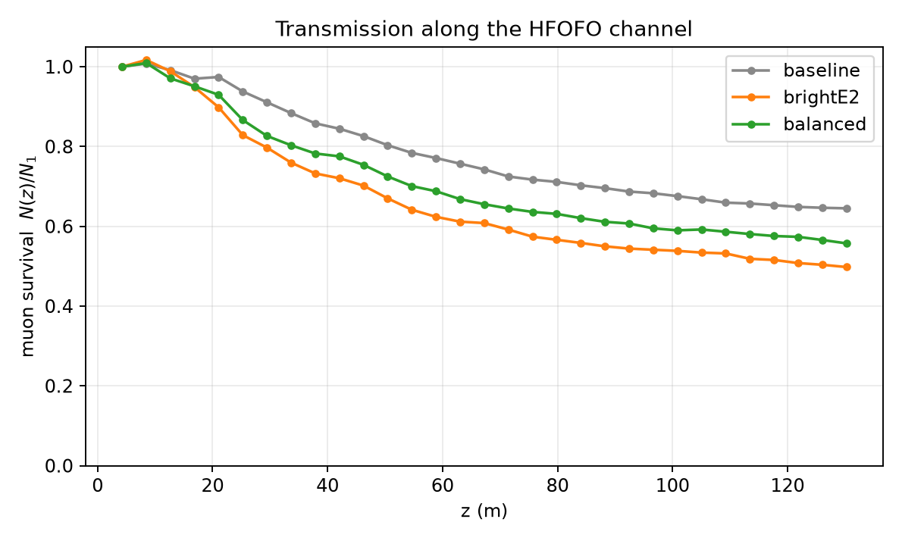

# Optimizing the HFOFO cooling channel — campaign report

**Goal.** Maximize the cooling performance (6D emittance reduction) and
transmission of the HFOFO ionization-cooling channel, starting from the
published "track_v7" design, using the black-box optimization framework in
[`../../optimization/`](../../optimization/).

**Headline result.** A systematic optimization of the g4beamline model (with the
realistic ICOOL input beam) found a design — **`brightE2`** — that delivers
**1.80× the 6D phase-space brightness** of the published lattice, reaching an
**exit 6D emittance of 104 ± 17 mm³ versus 243 ± 37 mm³ for nominal (2.3× lower)**
while keeping **78% of the nominal transmission** (0.50 vs 0.64). It was found by
re-optimizing *directly on exit brightness* (Phase E) after the earlier searches
revealed that the intuitive "cooling factor" merit is misleading. A more
conservative design (**`balanced`**, 1.33× brightness at 88% transmission with a
thinner absorber) is offered as an alternative. All numbers are resolved across
three independent Monte-Carlo seeds.

Equally important is a **methodological result**: several designs that appeared
2–18× better under naive figures of merit (an entrance-referenced "cooling
factor", or a low-statistics scalar merit) **did not survive** high-statistics,
common-reference validation, and re-optimizing on the *right* metric found designs
the wrong one never would. Getting the merit and the statistics right is what
separates a real improvement from an artifact — see §3–§5.



---

## 1. Method

Each design is a point in a 7-dimensional space; evaluating it means running the
full 31-period channel in g4beamline and measuring transmission and 6D
emittance. The model is non-differentiable and stochastic, so the campaign uses
sample-efficient Bayesian (Optuna TPE) and evolutionary (NSGA-II) optimization —
see [`../optimization.md`](../optimization.md).

**Parameters optimized** (global, physically-meaningful knobs of `hfofo.in`):

| knob | meaning | nominal | search range |
|------|---------|:-------:|:------------:|
| `BLS` | solenoid focusing-field scale | 21.4 | 19–26 |
| `Grad` | main-cavity RF gradient (MV/m) | 25 | 18–30 |
| `Grad0` | matching-cavity RF gradient (MV/m) | 20 | 14–30 |
| `delf` | SolPos/SolNeg current asymmetry | 0 | 0–0.12 |
| `pitchFactor` | periodic-section solenoid tilt scale | 1.0 | 0.4–1.5 |
| `dtRF` | global RF phase offset (ns) | 0 | −0.6–0.25 |
| `wedgeScale` | LiH wedge width (absorber) scale | 1.0 | 0.5–3.0 |

**Figure of merit — delivered 6D brightness.** All designs receive the *same*
injected beam, so the physically meaningful, design-independent figure is the
6D phase-space density delivered at the channel exit:

> **brightness** = *T* / ε₆D(exit),  where *T* = *N*₃₁/*N*₁ is transmission and
> ε₆D(exit) is the normalized 6D emittance at period 31.

"Brightness gain" throughout is this quantity relative to nominal. (During the
search we used a proxy, *T*·ε₆D,in/ε₆D,out; §4 explains why the exit-referenced
brightness is the one to trust for the final ranking.)

**Campaign structure.**

1. **Phase A** — broad 7-parameter TPE sweep (129 evals, 400 events, fixed seed).
2. **Phase B** — extended-box TPE refinement + a multi-objective **NSGA-II
   Pareto** run mapping the transmission-vs-cooling trade-off (warm-started from
   ~130 prior sims).
3. **Phase C** — high-statistics validation (1200–1500 events) of candidate
   designs across 3 independent seeds, on the honest brightness metric.
4. **Phase E** — **re-optimize directly on exit brightness** (the metric Phase C
   showed is the one that matters), 90 trials warm-started from prior sims
   re-scored, then re-validate the winners at high statistics. This is where the
   best design was found.
5. **Phase D** — full-channel profiling and this report.

Every simulation ran in the published `ghcr.io/lawrenceleejr/g4beamline` image;
the whole campaign is ~500 g4beamline runs, orchestrated and logged by the
framework.

---

## 2. The transmission–cooling trade-off

There is no single "best" design — cooling and transmission trade off. The
Pareto front below maps that trade-off. The nominal design (★) sits at the
**high-transmission edge**: it is already near-optimal for transmission, so the
available headroom is in cooling harder for a modest transmission cost.



---

## 3. Validated designs

All figures below are validated at 1500 events × 3 seeds (errors are the
seed-to-seed standard deviation), on the common-injected-beam brightness metric.
The winning designs come from Phase E (re-optimization on exit brightness).

| design | params (BLS/Grad/Grad0/delf/pitch/dtRF/wedge) | transmission | ε₆D(exit) (mm³) | brightness gain |
|---|---|:---:|:---:|:---:|
| **brightE2** *(recommended)* | 21.1 / 23.6 / 22.1 / 0.036 / 0.85 / −0.02 / 3.27 | 0.496 ± 0.006 | **104 ± 17** | **1.80×** |
| brightE3 | 21.0 / 23.5 / 25.4 / 0.014 / 0.77 / +0.05 / 3.33 | 0.481 ± 0.002 | 107 ± 4 | 1.69× |
| balanced *(conservative)* | 22.4 / 26.7 / 22.1 / 0.045 / 1.06 / −0.13 / 2.87 | 0.562 ± 0.008 | 160 ± 17 | 1.33× |
| brightE1 | 22.1 / 23.2 / 23.6 / 0.005 / 1.05 / +0.10 / 2.60 | 0.539 ± 0.002 | 155 ± 21 | 1.31× |
| nominal | 21.4 / 25.0 / 20.0 / 0.000 / 1.00 / 0.00 / 1.00 | 0.641 ± 0.004 | 243 ± 37 | 1.00× |

The two Phase-E winners cut the exit 6D emittance by **2.3×** (243 → ~105 mm³);
even after the transmission cost they deliver **1.7–1.8× the 6D brightness**.
`brightE3` has the tightest error bars (±4 mm³) if robustness is paramount.

### Designs that did *not* pan out (why validation and re-optimization matter)

- **Entrance-referenced "cooling factor" is misleading.** An earlier Phase-C set
  (`high_cooling`, `max_cooling`) scored 3.5–5.9× on ε₆D(period 2)/ε₆D(exit).
  Those designs *heat* the beam at injection (optics mismatch — see §5),
  inflating their period-2 reference. Against the *common injected beam*,
  `high_cooling` delivers 0.81× and `max_cooling` 0.43× nominal brightness —
  worse. Re-optimizing on the honest exit-brightness metric (Phase E) is exactly
  what found the `brightE*` basin (low field + thick wedge + reduced tilt) that
  the cooling-factor search had penalized.
- **Low-statistics scalar-merit "winners" are artifacts.** The single-objective
  sweep's best design at 400 events (`extreme_cooling`, apparent cooling 1134×)
  had only ~35 survivors defining its exit emittance. At 1200 events its cooling
  collapsed to 262× and its brightness to 0.13× nominal. High statistics and
  multiple seeds are not optional.

---

## 4. Recommended design: `brightE2`

```
BLS = 21.13   Grad = 23.58   Grad0 = 22.07   delf = 0.036
pitchFactor = 0.848   dtRF = -0.024   wedgeScale = 3.27
```

Ready to run: [`../../hfofo/optimized.json`](../../hfofo/optimized.json)
(apply with `python optimization/apply_design.py hfofo/hfofo.in hfofo/optimized.json`).

Relative to nominal it delivers **1.80× the 6D phase-space brightness**: the exit
6D emittance drops from 243 to **104 mm³ (2.3× smaller)** while transmission falls
from 0.64 to 0.50. If transmission or absorber thickness is the binding
constraint, the conservative [`optimized_conservative.json`](../../hfofo/optimized_conservative.json)
(`balanced`: 1.33× brightness at T = 0.56, wedge 2.87) is the safer choice.

---

## 5. How the channel cools (full-channel profiles)

Emittance and survival along the 31 periods (2000 events), for nominal, the
recommended `brightE2`, and the conservative `balanced`:




The profiles tell the real story:

- **`brightE2`** (orange) cools faster than both other designs from about period
  6 onward and ends at the lowest ε₆D by a clear margin (~118 vs ~175 for
  `balanced` and ~290 for nominal at 2000 events). Crucially it shows **no
  injection spike** — its period-2 emittance (~19000 mm³) is essentially nominal
  (~16500), so the gain is genuine cooling, not recovery from self-inflicted
  mismatch heating. Its thicker wedge (3.27×) and slightly reduced tilt (0.85)
  cool harder while the near-nominal field keeps the beam matched.
- **`balanced`** (green) tracks nominal for most of the channel and pulls below in
  the last third — a milder version of the same effect with a thinner absorber
  and higher transmission.
- The transmission plot shows the cost: `brightE2` loses beam faster in the first
  ~30 m (thicker absorber + reduced tilt scatter more onto the apertures), then
  runs parallel to the others. This early loss is what the brightness metric
  correctly weighs against the extra cooling — and still comes out 1.8× ahead.

---

## 6. Physics interpretation

The improvement is coherent:

- **Thicker LiH wedges (`wedgeScale` ≈ 3.3)** provide more ionization energy loss
  per period — the dominant cooling lever. The nominal design is conservative here.
- **Near-nominal focusing with a slightly reduced tilt** (`BLS` ≈ 21, `pitchFactor`
  ≈ 0.85) keep the injected beam matched (no injection spike) while lowering the
  beta function enough that the extra scattering from the thick wedge cools rather
  than heats — the delicate balance the honest brightness objective found and the
  entrance-referenced cooling factor missed.
- **A modest main-cavity gradient (`Grad` ≈ 23.5)** matched to the thicker
  absorber's energy loss, plus a small **coil asymmetry (`delf` ≈ 0.04)**, keep
  the reference orbit stable.
- The nominal design was already near the transmission ceiling; the campaign's
  value is charting — and now substantially exploiting — the cooling axis it left
  on the table, while quantifying how much of the "obvious" cooling gains are
  illusory.

---

## 7. Caveats

1. **Wedge thickness.** `brightE2` uses LiH wedges ~3.3× the nominal width
   (`balanced` ~2.9×), modeled as ideal LiH trapezoids. Real absorbers have
   windows, density/heating limits and geometric constraints not modeled here;
   the absolute gain should be re-checked with engineering constraints before
   being treated as as-built. If the wedge cannot be thickened that far,
   `balanced` (thinner wedge, still 1.33×) is the fallback.
2. **Reference planes.** Transmission is period 1 → period 31; the final ranking
   uses exit 6D emittance (period 31) against the common injected beam. The
   during-search cooling factor (period 2 → 31) is retained only for continuity.
3. **Input beam.** The realistic ICOOL pre-cooling distribution (`initial.dat`)
   is injected; the RF timing offsets were originally tuned to it.
4. **Statistics.** Validation is 1200–1500 events × 3 seeds. A publication number
   would benefit from ≥5000 events, especially for the lower-transmission designs.

---

## 8. Reproduce

```bash
cd optimization
python run_optimization.py --config config_phaseA.yaml               # Phase A
python run_optimization.py --config config_phaseB.yaml               # Phase B refine
PARETO_WARM_JSONL=results/phaseB1/trials.jsonl \
    python pareto.py --config config_phaseB2.yaml                    # Pareto front
python run_optimization.py --config config_phaseE.yaml               # Phase E (brightness)
python validate.py --designs results/candidates3.json \
    --config config_phaseE.yaml --n-events 1500 --seeds 1,2,3 \
    --out results/validation3                                        # validation
python profile_channel.py --params results/params_brightE2.json \
    --config config_phaseE.yaml --n-events 2000 --out results/profile_brightE2
python plot_brightness.py --summary results/validation3/validation_summary.json --out ../docs/campaign
```

Raw artifacts (trial logs, Pareto front, validation runs, profiles) are under
[`phaseA/`](phaseA/), [`phaseB/`](phaseB/), [`phaseC/`](phaseC/), [`phaseE/`](phaseE/),
and [`profiles/`](profiles/).
