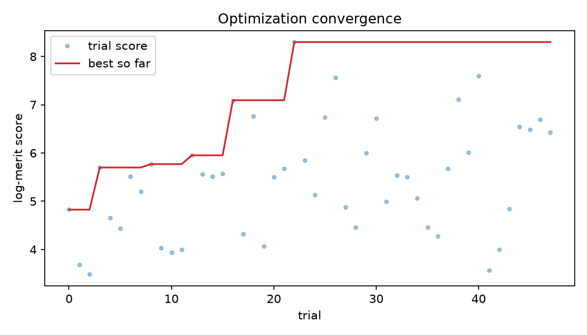
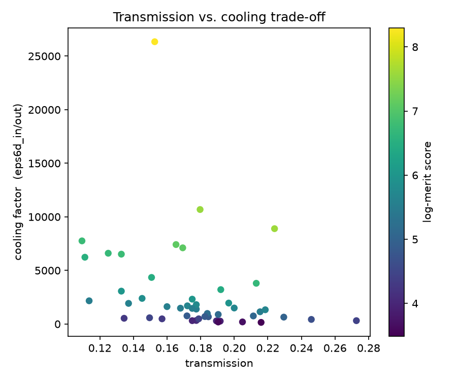
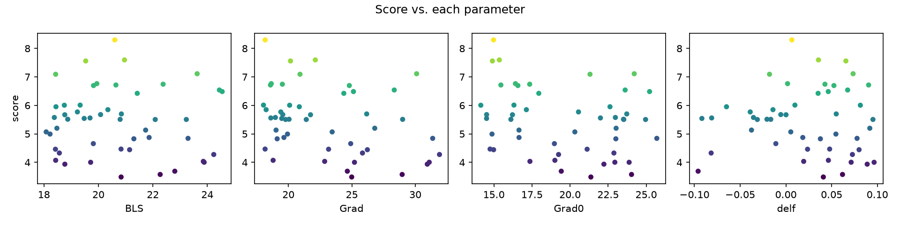

# Demonstration optimization run

A first end-to-end optimization, run with this framework against the published
g4beamline image, to show the machinery working and to characterize the
behaviour of the HFOFO channel. **Treat the absolute numbers as a demonstration,
not a physics result** — see the caveats below.

## Setup

- **Optimizer:** Optuna TPE (Bayesian), 48 trials, 3 parallel workers.
- **Parameters:** `BLS` ∈ [18, 25], `Grad` ∈ [18, 32], `Grad0` ∈ [14, 26],
  `delf` ∈ [−0.1, 0.1].
- **Per trial:** 200 muons through the full 31-period channel (~10–25 s each).
- **Merit:** `score = log(T · eps6D_in/eps6D_out)`, entrance = `out1`, exit = `out31`.

## Result

The TPE sampler improved the merit from a median of ~5.5 to a best of **8.30**,
converging toward **low solenoid scale and low RF gradient**:

| | BLS | Grad | Grad0 | delf | T | eps6D_in→out | score |
|--|-----|------|-------|------|---|--------------|-------|
| nominal | 21.4 | 25 | 20 | 0 | ~0.36* | — | ~6.6* |
| **best (trial 22)** | 20.6 | 18.2 | 15.0 | 0.007 | 0.15 | 457405 → 17.4 | **8.30** |

\* nominal measured separately at lower statistics.





The trade-off plot shows the expected tension: the highest-transmission designs
are not the highest-cooling designs, and the optimizer picks points that balance
the two under the density-gain merit.

## Caveats (important)

1. **The "cooling factor" is inflated by halo scraping.** The entrance detector
   `out1` sits at the *first* period, where the wide Gaussian injection
   (σx = 80 mm, σp = 100 MeV/c) still carries a large uncaptured halo. Most of the
   apparent eps6D reduction from `out1` to `out31` is the channel scraping that
   halo on the apertures (acceptance), not steady-state ionization cooling. For a
   clean cooling measurement, compare two *interior* periods (e.g. `out3` vs
   `out28`) — trivial to do: set `entrance_detector`/`exit_detector` in
   `config.yaml`.
2. **Low exit statistics.** ~20 muons survive to `out31` at 200 launched, so the
   exit emittance (and thus the score) is noisy. Raise `n_events` for production.
3. **Injected beam is a generic Gaussian, not the real upstream distribution.**
   `hfofo/initial.dat` (the ICOOL pre-cooling beam) can be injected instead for a
   realistic study; the RF timing offsets in `hfofo.in` were originally tuned to
   it.
4. The optimizer's drift toward low gradient/field maximizes *this* merit on
   *this* injection; it is not yet a recommendation for the physical design.

## Reproduce

```bash
cd optimization
python run_optimization.py --config config_demo.yaml
```

(`config_demo.yaml` is the demo configuration; `config.yaml` is the documented
default.)
