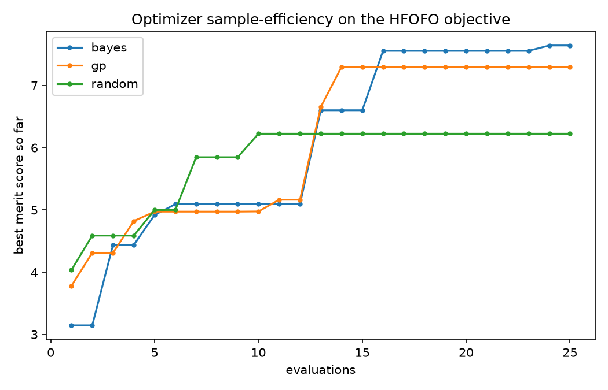

# Which optimizer is most efficient?

Because every evaluation is an expensive g4bl Monte-Carlo run, the question
*"how do we optimize most efficiently"* comes down to: **which optimizer reaches
a good design in the fewest evaluations?** This is a direct, apples-to-apples
comparison run with `optimization/compare_optimizers.py`.

## Setup

- Same 4-parameter space (`BLS`, `Grad`, `Grad0`, `delf`), same merit.
- **25 evaluations each** for Optuna **TPE** (`bayes`), scikit-optimize
  **Gaussian-process** BO (`gp`), and **random** search.
- 150 muons per trial; interior detectors `out3` → `out28` (to lean toward
  steady-state cooling rather than period-1 halo scraping).

## Result



| optimizer | best merit (25 evals) | reached ~7.3 by eval |
|-----------|----------------------:|:--------------------:|
| **TPE (bayes)** | **7.64** | ~16 |
| GP (skopt) | 7.30 | ~14 |
| random | 6.23 | never |

Both Bayesian optimizers find clearly better designs than random search, which
gets lucky early (it leads through eval ~12) but then **stalls at 6.23** — it has
no model of the objective, so it cannot exploit what it has learned. Once the
surrogate-based methods have ~12–15 samples to build a model, they both jump past
random and keep improving. TPE edged out GP here and parallelizes trivially
(`n_jobs > 1`), which is why it's the framework default; GP is competitive and
tends to win when evaluations are scarcest.

## Takeaways for efficient HFOFO optimization

1. **Use Bayesian optimization, not scans or random search.** The whole point is
   sample efficiency when each sample is a physics simulation.
2. **Parallelize evaluations** (`n_jobs`): trials are independent, so wall-clock
   time drops nearly linearly with cores. (This comparison used 3 workers.)
3. **Spend your evaluation budget on the model, not on noise.** A modest
   `n_events` with many trials beats a huge `n_events` with few — but raise
   `n_events` once you're polishing near the optimum so improvements aren't lost
   in Monte-Carlo scatter. Fixing the g4bl seed across nearby designs (common
   random numbers) further sharpens the comparison.
4. **Two-stage strategy:** a broad parallel TPE sweep to localize the good
   region, then a short GP polish (or higher-statistics TPE) inside a narrowed
   range.

## Reproduce

```bash
cd optimization
python compare_optimizers.py --n-trials 25 --n-events 150 --methods bayes,gp,random
```
